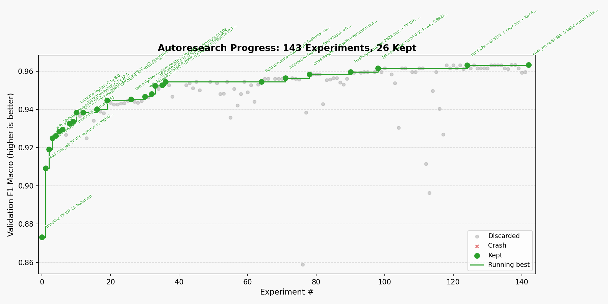

# autoresearch — Fake Job Posting Classifier



An autonomous AI research loop applied to a real-world binary text classification problem: **detecting fraudulent job postings**. An AI agent modifies the classifier code, trains it, checks whether the result improved, keeps or discards the change, and repeats — indefinitely, without human intervention.

## The task

The dataset is the [Real/Fake Job Posting Prediction dataset](https://www.kaggle.com/datasets/shivamb/real-or-fake-fake-jobposting-prediction) — ~18,000 job descriptions scraped from the web, of which roughly 800 (~5%) are labeled `fraudulent = 1` (fake).

Each job posting contains several text fields: `title`, `company_profile`, `description`, `requirements`, and `benefits`. These are concatenated into a single text string, optionally augmented with structured metadata (employment type, location, salary range, presence of a company logo, etc.).

**The core challenge is class imbalance.** With only ~5% fake postings, a naive classifier that always predicts "real" achieves ~95% accuracy — and catches zero fakes. The primary metric is therefore **`val_f1_macro`** (macro-averaged F1 across both classes), which forces the model to perform well on the minority fake class. The secondary metric is **`val_pr_auc`** (precision-recall AUC), which is particularly informative for imbalanced detection tasks.

## What the agent explores

The agent is constrained to edit a single file, `train.py`, within a **2-minute wall-clock training budget** on CPU. It cannot install new packages, touch the evaluation harness, or access the test set during experimentation.

Over 144 experiments logged in `results.tsv`, the agent explored a wide range of directions:

**Feature engineering**
- Word TF-IDF with varying vocabulary sizes (up to 110k features)
- Character n-gram TF-IDF (`char_wb` analyzer, ranges like `(3,5)`, `(4,6)`)
- `HashingVectorizer` with large hash spaces (up to 1M buckets) to avoid vocabulary limits
- Unigram + bigram combinations via `FeatureUnion` / `sp.hstack`
- Structured metadata encoded as pseudo-tokens (e.g. `__industry_finance`)
- Numeric field features: per-field presence flags, log-length, binary metadata flags, interaction terms (e.g. missing company profile × missing logo as a strong fake signal)

**Classifiers**
- `LogisticRegression` (lbfgs, liblinear, saga) with varying regularization strength `C`
- `LinearSVC` — the workhorse for high-dimensional sparse text; fast on CPU
- `LGBMClassifier`, `XGBClassifier`, `MLPClassifier`, `SGDClassifier`, `PassiveAggressiveClassifier` — most proved too slow or weaker on this data
- Ensembling: `VotingClassifier`, `BaggingClassifier`, stacked SVCs — generally not worth it

**Class imbalance handling**
- `class_weight='balanced'` and manual positive-class weights (1:6 through 1:20)
- Decision threshold tuning: exhaustive scan over the SVC decision function scores to maximize `val_f1_macro`

**What worked**
The best configuration (`val_f1_macro ≈ 0.9634`) combines:
- Unigram `HashingVectorizer` (512k buckets) + bigram `HashingVectorizer` (512k) + `TfidfTransformer`
- Character n-gram TF-IDF (`char_wb`, `(4,6)`, 38k features)
- Explicit numeric field features (presence, log-length, interaction terms) scaled and concatenated
- `LinearSVC` with class weight `{0: 1.0, 1: 10.0}`, `C=0.8`, `max_iter=4000`
- Decision threshold tuned on validation scores

The baseline (TF-IDF + Logistic Regression, balanced) started at `val_f1_macro ≈ 0.873`. Over 83 kept or discarded experiments up to the current best, the agent improved it by roughly **+0.090 F1**.

## How it works

The repo has three files that matter:

| File | Role |
|---|---|
| `prepare.py` | Fixed constants, data loading, train/val/test splits, evaluation harness. **Do not modify.** |
| `train.py` | Everything the agent edits: feature engineering, classifier, hyperparameters, threshold tuning. |
| `program.md` | Agent instructions — the "research org spec" that a human iterates on. |

Each experiment follows this loop:

1. Edit `train.py` with a new idea
2. `git commit`
3. `uv run train.py > run.log 2>&1`
4. Read `val_f1_macro` and `val_pr_auc` from the log
5. If improved by ≥ 0.002 (or code is simplified with no regression): **keep** the commit
6. Otherwise: `git reset` back to the previous best and **discard**
7. Record the result in `results.tsv`
8. Repeat indefinitely

The progress chart above shows each experiment as a dot (green = kept, grey = discarded), with the running best drawn as a staircase line. The chart is regenerated by `progress.py`.

## Quick start

**Requirements:** Python 3.10+, [uv](https://docs.astral.sh/uv/). Runs on CPU — no GPU needed.

```bash
# Install uv (if you don't have it)
curl -LsSf https://astral.sh/uv/install.sh | sh

# Install dependencies
uv sync

# Download the dataset and prepare splits (one-time, ~1 min)
uv run prepare.py

# Run a single training experiment manually
uv run train.py
```

## Running the agent

Open your agent (Claude, Codex, etc.) in this repo and point it at `program.md`:

```
Have a look at program.md and kick off a new experiment run.
```

The agent will set up a branch, establish a baseline, and begin the experiment loop autonomously. You can leave it running overnight and wake up to a full experiment log.

## Regenerating the progress chart

```bash
uv run progress.py
```

This reads `results.tsv` and writes a new `progress.png`.

## Project structure

```
prepare.py      — fixed data prep, splits, and evaluation (do not modify)
train.py        — classifier pipeline edited by the agent
program.md      — agent instructions
progress.py     — script to regenerate the progress chart from results.tsv
results.tsv     — experiment log (untracked by git)
pyproject.toml  — dependencies (scikit-learn, xgboost, lightgbm, matplotlib)
```

## License

MIT
